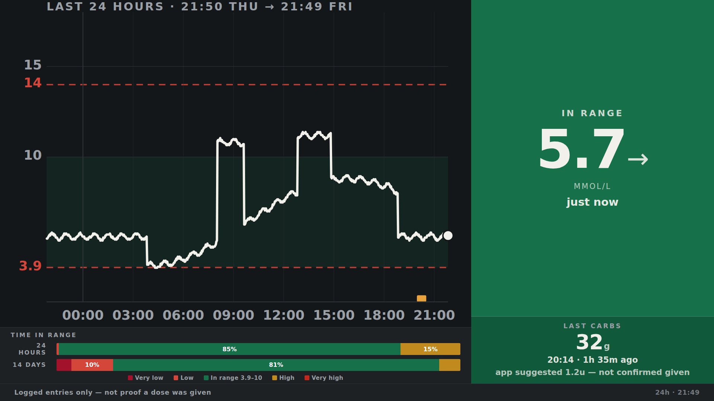
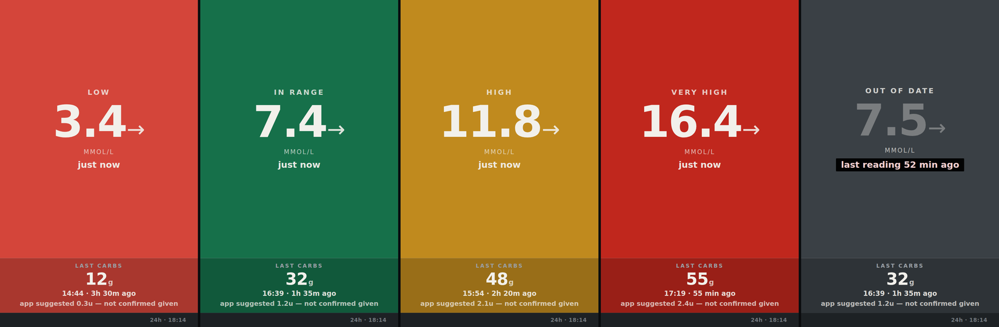

# T1 CGM Display

A wall display for a continuous glucose monitor. Runs on a spare PC or
a Raspberry Pi, shows the last 24 hours on a TV wherever you need it, and stays
entirely on your own network.

Built for a three-year-old on FreeStyle Libre 2 Plus with insulin pens, but it
suits anyone with Type 1 — adult or child, pens or pump. Uses Nightscout as the
datastore; most of it applies to any Libre or Dexcom setup. We're moving to an
Omnipod 5 soon, so keep an eye out for more updates!



The panel colour is the across-the-room signal — you read it before you read
the digits:



Left to right: low, in range, high, very high, and out of date. That last one
matters most. If the newest reading is more than 15 minutes old the colour
drains away entirely, because colour is a claim about *right now* and a stale
reading has no claim to make. A display that keeps showing a confident green
number from forty minutes ago is worse than one showing nothing.

*(All screenshots use invented data.)*

---

## What it does

- **Glucose** from Libre 2 Plus via LibreLinkUp, at one reading a minute
- **Carbs** from Glooko, for anyone whose pump or pen app forwards there
- **24-hour trace** with treatment markers, on a TV that boots straight into it
- **Telegram alert** when the data feed stops
- **Nightly encrypted backups** to another machine

## What it deliberately does not do

**It is not an alarm and must never become one.** The CGM vendor's own app
owns that job — it is the regulated, validated path, and it is what wakes you
at 3am. This display is a record and a convenience. If it ever gets treated as
"no alert means everything is fine", it is doing harm.

**It does not calculate doses.** Nightscout's bolus wizard stays off. The pen
and the vendor app own dosing.

**It is not a medical device.** Nothing here is validated for clinical use.

---

## The design rules that matter

The display's job is to be honest about what it knows, which is harder than it
sounds when the data source is unreliable:

- **Colour is a claim about right now.** If the newest reading is more than 15
  minutes old, the panel drains to grey and the age appears in a black badge.
  A stale reading never sits there looking green.
- **Every value carries its age**, at the same weight as the value itself.
- **Gaps are bridged visibly.** A dashed connector, not a solid line — a real
  sensor outage never passes as data you have.
- **"None logged" is never "0".** A zero is a claim about the person; "none
  logged in 12 hours" is a claim about the logbook, which is all the display
  can honestly make.
- **The axis grows, it never clips.** A fixed ceiling draws a flat line across
  the top and understates how high they actually went.
- **The caveat never leaves the screen**, and it says so when the server is
  unreachable rather than leaving old numbers looking current.

On pens specifically: the vendor app records the carb entry and its own dose
*suggestion*, but nothing links it to what was actually injected. So the panel
shows carbs with "app suggested 1.6u — not confirmed given" rather than a
bolus figure of zero, which would read as "no insulin given".

---

## Glooko: upstream is broken

`nightscout-connect`'s Glooko driver returns no treatments. The v2 endpoints
now require `lastUpdatedAt`, `limit` and `lastGuid`; the driver still sends
`startDate`/`endDate`, gets a 422, and reports "0 treatments" rather than an
error — so it looks exactly like an account with no data.

See [nightscout-connect#38](https://github.com/nightscout/nightscout-connect/issues/38).

`glooko-carbs.py` here queries correctly and posts to Nightscout directly. It
also takes the timezone from the account's own `utcOffset`, so BST is handled
without editing a config file twice a year.

If you are debugging your own Glooko account, `glooko-probe.sh` logs in and
reports what each endpoint actually holds.

---

## Setup

```bash
git clone https://github.com/M0UPM/T1-CGM-Display.git
cd T1-CGM-Display
./setup.sh
```

`setup.sh` walks through the whole thing and **validates as it goes** rather
than letting you find out later that something was wrong. It tests your
LibreLinkUp login before saving it (and works out whether your account is on
`EU` or `EU2`, which otherwise you only discover from an error in a log file),
creates the Nightscout role and access token that the web UI makes fiddly,
hashes that token correctly for the bridge, and sends a test alert so you know
the notification path works.

It's safe to re-run — it keeps what already works.

Prefer to do it by hand, or something went wrong? [SETUP.md](SETUP.md) has the
full walkthrough, including the two steps that cost most people an hour.

Two things that will cost you an hour if you skip them, both covered in
SETUP.md: the Nightscout access token needs a custom role for
`api:entries:create`, and the LibreLinkUp bridge wants the **SHA1 hash** of
that token rather than the token itself.

## Reducing the lag

The display will run a minute or two behind the phone. Most of that is
upstream and not tunable:

| Hop | Typical delay | Tunable |
|---|---|---|
| Sensor to phone | 0-60s | no |
| Phone to vendor cloud | 30-90s, variable | no |
| Cloud to bridge | up to 60s | already at the minimum |
| Bridge to display | up to `POLL_CURRENT_SEC` | **yes** |

Two things you can change:

**`POLL_CURRENT_SEC`** at the top of `display/index.html` - how often the page
asks Nightscout for the newest value.
It defaults to 15 seconds. Lowering it further has rapidly diminishing returns
— the vendor cloud hop dominates — but it costs almost nothing, since it's one
small request to a machine on your own LAN.

**`libre-poll.py`**, an optional replacement for the bridge container. The
bridge polls once a minute, which is its floor - it schedules on cron, and
`*/1` is as fine as cron gets. `libre-poll.py` uses a plain interval instead:

```bash
./libre-poll.py --dry-run        # see what it would post
./libre-poll.py --loop 30        # every 30 seconds
```

Readings are deduplicated by timestamp, so polling faster than they arrive is
harmless. Unit file in `systemd-units.txt`. Stop the bridge container if you
switch: `docker compose stop librelink`.

Be realistic about the gain. Halving the poll interval halves *that hop* only,
and the phone-to-cloud hop is usually larger and entirely outside your
control. Going from 60s to 30s is worth having; going to 10s is not.

## More than one screen

The display machine serves on `0.0.0.0:8080`, so any browser on the LAN can
see it. To put the same display on a TV in another room, a Raspberry Pi is
enough — it only needs a browser, not the whole stack:

```bash
# on the Pi - Pi OS Lite is fine and preferable
sudo apt update && sudo apt install -y chromium-browser git
git clone https://github.com/M0UPM/T1-CGM-Display.git
cd T1-CGM-Display
KIOSK_URL=http://<display-machine>:8080/ ./install-kiosk.sh
sudo reboot
```

Nothing changes on the server. The second screen is read-only and shows
exactly the same thing, including the greyed-out state if the feed stops — so
both rooms tell the same truth.

Tested on a Pi 3 Model B with Pi OS Lite. The installer works out that there's
no desktop, installs `cage` and `seatd`, takes tty1 off getty and boots
straight to the display. It also skips the Docker dependency, since a viewer
doesn't run the stack.

## Requirements

- Any amd64 machine or a Pi 5. **Check for AVX** — MongoDB 5+ needs it, and
  plenty of current low-power CPUs (Celeron, Atom, N-series) lack it.
  `preflight.sh` tells you.
- SSD or NVMe, not an SD card. A minute-resolution feed writes continuously.
- Docker, and a TV with an HDMI input.

---

## Security

This handles health data. The defaults assume LAN-only:

- Nothing is exposed to the internet. The only outbound traffic is the poll to
  the CGM vendor and the encrypted backup.
- `AUTH_DEFAULT_ROLES` is `readable` because nothing is reachable from
  outside. **If you ever expose this, change it to `denied` first** or the URL
  alone gives anyone the full history.
- Backups are age-encrypted before they leave the machine, and pruned at both
  ends. `REMOTE_KEEP_DAILY` and `REMOTE_KEEP_WEEKLY` in `.env` control how much
  the backup host holds; the remote is only pruned when that night's upload
  actually succeeded, so a failed transfer never deletes good copies.
- `.env` holds plaintext credentials. It is gitignored — keep it that way. If
  you ever commit it, change every credential rather than just deleting the
  file.

---

## Licence

AGPL-3.0-or-later, matching the Nightscout ecosystem this builds on.

## Thanks

Nightscout, `nightscout-librelink-up`, and the wider DIY diabetes community,
who worked all this out first and gave it away.
